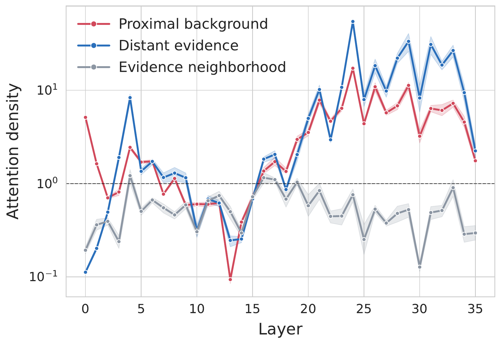
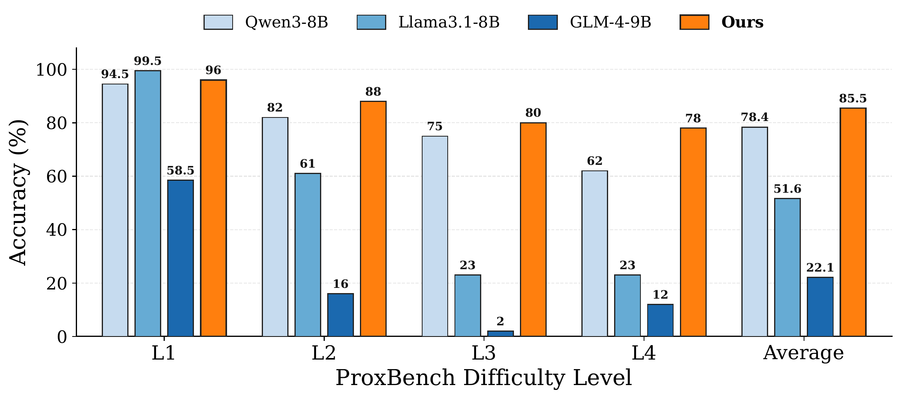

<div align="center">


<h1>The Sirens’ Song:When Proximal Background Context Overshadows Distant Evidence</h1>


<br clear="left">

<!-- <a href='https://xiaoyuyoung.github.io/APO/'></a> -->

<!-- <a href="https://arxiv.org/abs/2510.04142"></a>
<a href='https://huggingface.co/datasets/MiaoMiaoYang/CXR-MAX/'></a> -->
<!-- <a href='https://xiaoyuyoung.github.io/APO/'></a> -->
</div>


> **TL;DR:** Long-context models may locate distant evidence but still fail to use it because many nearby, task-irrelevant tokens collectively absorb attention. LYRA reshapes query-key matching so that relevant evidence remains distinguishable under this competition.


This repository is a PyTorch implementation of LYRA proposed in *The Sirens’ Song: When Proximal Background Context Overshadows Distant Evidence* 

Long-context LLMs focus on retrieving distant evidence from extensive context, yet existing work has largely focused on overcoming distance alone.
In this work, we identify the Proximity Trap: insufficient attention to distant evidence often arises less from distance itself than from cumulative competition with abundant, task-irrelevant proximal background.
To address the Proximity Trap, we introduce LYRA (**L**ong-context heav**Y**-tailed **R**elevance **A**lignment), a t-distributed directional matching mechanism that reshapes the context retrieval distribution to redistribute attention mass toward task-relevant evidence, while preserving the relative positional information encoded.
Extensive experiments on LongBench-v2, RULER, and LongBench demonstrate consistent improvements across context lengths and task categories. We further introduce ProxBench, a multi-level fine-grained benchmark for evaluating distant evidence utilization under increasing proximal background interference.


## Main findings

### The Proximity Trap

Long-context failures are not caused by distance alone. We find that **proximal background**—nearby context that is coherent but unnecessary for the task—can collectively overshadow **distant evidence** through softmax competition.

- **Distant evidence can be found but still diluted.** On Qwen3-8B, attention to the relevant distant span rises sharply in later layers (from approximately layer 19), while ordinary tokens at the same distant location remain below the uniform-attention baseline. The model can therefore identify the evidence, yet abundant proximal background still accumulates enough attention mass to weaken its use.
- **Moving evidence closer is not a reliable fix.** It produces mixed changes in evidence attention and answer confidence. Attenuating proximal background with the evidence and token positions held fixed more consistently restores evidence attention and often improves answer confidence.
- **Less nearby context can be more useful.** Progressively masking context nearest to the query improves LongBench-v2 accuracy, especially on long in-context learning tasks, revealing that accessible context can sometimes interfere rather than help.

<p align="center">
  
</p>

<p align="center"><em>Distant evidence is selectively retrieved but remains diluted by cumulative competition from proximal background. Attention density is normalized by uniform attention (dashed line).</em></p>

These observations motivate a broader view of long-context reasoning: what matters is not only how far away the evidence is, but also what it must compete with.

## LYRA

**LYRA** (**L**ong-context heav**Y**-tailed **R**elevance **A**lignment) is a heavy-tailed attention scoring mechanism designed to preserve distant yet relevant evidence under competition from nearby background. It:

1. measures relevance through normalized directional agreement between queries and keys;
2. applies a t-distributed transformation that compresses weak or misleading score advantages while amplifying strong matches; and
3. modifies only the query-key scoring stage, leaving causal masking, softmax normalization, and value aggregation unchanged.

Rather than favoring tokens based on their position, LYRA reshapes attention according to relevance. This helps distant evidence remain distinguishable when many nearby but uninformative tokens compete for attention, while requiring only a replacement of the conventional query-key scoring function.

## ProxBench


Existing long-context benchmarks primarily vary input length, but offer limited control over the nearby context that competes with distant evidence. [🤗 ProxBench](https://huggingface.co/datasets/MiaoMiaoYang/ProxBench)
 is a controlled benchmark designed to measure this proximal interference directly. It keeps the query and required evidence fixed, places the evidence at a distant position, and introduces task-irrelevant background near the query that becomes progressively more difficult to distinguish from the evidence.

| Level | Proximal interference |
|---|---|
| **1 - Style-matched** | Uses similar syntax while changing the entity, topic, and answer relation. |
| **2 - Crossed bindings** | Places familiar entities and relation cues together, but binds the candidate value to a different entity. |
| **3 - Mixed entity-relation** | Combines the same relation for other entities with different attributes of the target entity. |
| **4 - Fine-grained** | Introduces highly confusable subtypes, attributes, semantic roles, and value formats. |

This progression separates sensitivity to simple surface similarity from the ability to resolve fine-grained relevance. On ProxBench, LYRA achieves the best average accuracy and the strongest results on Levels 2-4, with a smaller performance drop than the evaluated base models as proximal interference becomes more challenging.

## Results

**Table 2. RULER results across controlled context lengths.** Accuracy (%) is reported at five context lengths following the evaluation setting of S2O. The best result in each column is shown in **bold**, and the second-best is <u>underlined</u>.

| Method | Venue | 8K | 16K | 32K | 64K | 128K | Avg. |
|---|---|---:|---:|---:|---:|---:|---:|
| FlexPrefill | ICLR '25 | 71.65 | 73.89 | 75.38 | 72.65 | 68.51 | 72.42 |
| XAttention | ICML '25 | 85.63 | 82.25 | 81.60 | 73.18 | 69.91 | 78.51 |
| ProxyAttn | ICLR '26 | <u>92.07</u> | <u>89.75</u> | <u>86.68</u> | <u>83.57</u> | <u>77.09</u> | <u>85.83</u> |
| S2O | ACL '26 | 85.80 | 82.73 | 80.34 | 73.95 | 69.97 | 78.56 |
| PBS-Attn | ICML '26 | 85.56 | 79.34 | 80.95 | 70.70 | 67.90 | 76.89 |
| **LYRA** | - | **96.33** | **94.19** | **93.14** | **85.39** | **77.56** | **89.32** |

On RULER, LYRA achieves the highest accuracy at every evaluated context length and improves the average score from 85.83 to 89.32 over the strongest competing method. The gains persist from 8K to 128K and peak at 32K (+6.46 points), showing that the improvement is not confined to a particular context range and remains effective as the amount of competing context increases.

<p align="center">
  
</p>

<p align="center"><em><strong>Figure 4.</strong> Evaluation on ProxBench across four progressively challenging proximal perturbation levels. LYRA achieves the best average accuracy and leads on Levels 2-4.</em></p>

On ProxBench, LYRA obtains an average accuracy of 85.5%, outperforming the strongest evaluated base model by 7.1 points. Although Llama3.1-8B performs slightly better at Level 1, LYRA leads from Levels 2 to 4 with accuracies of 88%, 80%, and 78%, respectively. At the most challenging level, LYRA exceeds the strongest base model by 16 points, demonstrating substantially greater robustness when nearby background becomes highly similar to the distant evidence while remaining logically irrelevant.

## Installation

Python 3.10 or newer is required. Create an isolated environment and install the
package in editable mode:

```bash
python -m venv .venv
source .venv/bin/activate
python -m pip install --upgrade pip
python -m pip install -e '.[test,eval]'
```

LYRA loads models from local files by default. One way to obtain Qwen3-8B with the
current Hugging Face CLI is:

```bash
hf download Qwen/Qwen3-8B --local-dir ./models/Qwen3-8B
```

The `models/` directory is ignored by Git. Review and comply with the model's
license and terms before use.

## Training data

Training inputs must remain outside version control. LYRA accepts local JSON or
JSONL files, optionally gzip-compressed. Supported records include either:

- a `messages` or `conversations` array with user and assistant turns; or
- an instruction/question plus an `answer`, `output`, or `response` field.

The final assistant turn is used as the supervised target by default. Inputs that
exceed `--max-length` raise an error unless truncation is explicitly enabled.

Use only data that you are permitted to process. Keep evaluation benchmarks out
of training data, and document dataset provenance in your own experiment records.

## Training

The included launcher requires paths through environment variables and contains
no machine-specific defaults:

```bash
MODEL_DIR=./models/Qwen3-8B \
TRAIN_FILE=/path/to/train.jsonl \
OUTPUT_DIR=./outputs/lyra-qwen3-8b \
bash scripts/train_2gpu.sh
```

Equivalent direct invocation:

```bash
torchrun --standalone --nproc_per_node=2 -m lyra.train \
  --model ./models/Qwen3-8B \
  --train-file /path/to/train.jsonl \
  --output-dir ./outputs/lyra-qwen3-8b \
  --max-length 16384 \
  --strategy last_block \
  --tvmf-layers last \
  --gradient-checkpointing
```

The final compact checkpoint stores trainable tensors and tokenizer files. Local
source paths are not embedded in its public metadata. Pass the base model explicitly
when loading a compact checkpoint on another machine.

## Inference

```bash
python -m lyra.generate \
  --checkpoint ./outputs/lyra-qwen3-8b \
  --base-model ./models/Qwen3-8B \
  --prompt "Summarize the role of long-context attention."
```

## Evaluation

Evaluation data is not included. Obtain LongBench or LongBench-v2 from their
official repositories and keep the files under an ignored directory such as
`external_data/`.

```bash
CHECKPOINT=./outputs/lyra-qwen3-8b \
BASE_MODEL=./models/Qwen3-8B \
LONGBENCH_V2=./external_data/LongBench-v2/data.json \
bash scripts/evaluate_longbench_v2.sh

python -m lyra.score_longbench --results-dir ./outputs/evaluation
```

Relevant upstream projects:

- [Qwen3](https://huggingface.co/Qwen/Qwen3-8B)
- [LongBench](https://github.com/THUDM/LongBench)
- [LongBench-v2](https://github.com/THUDM/LongBench-v2)
